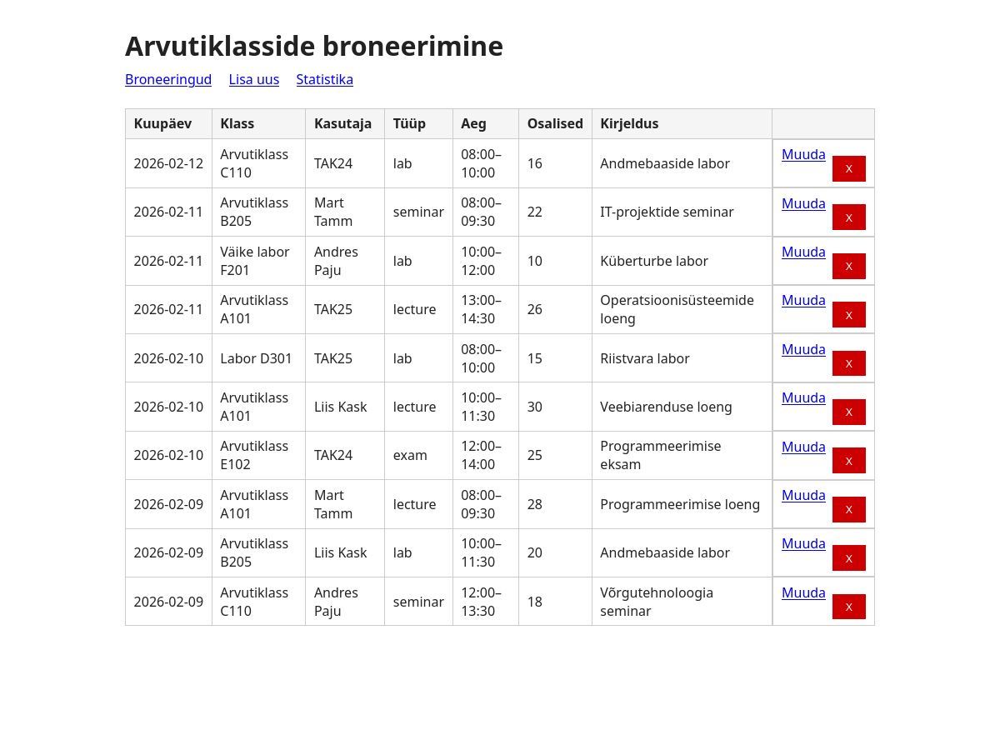
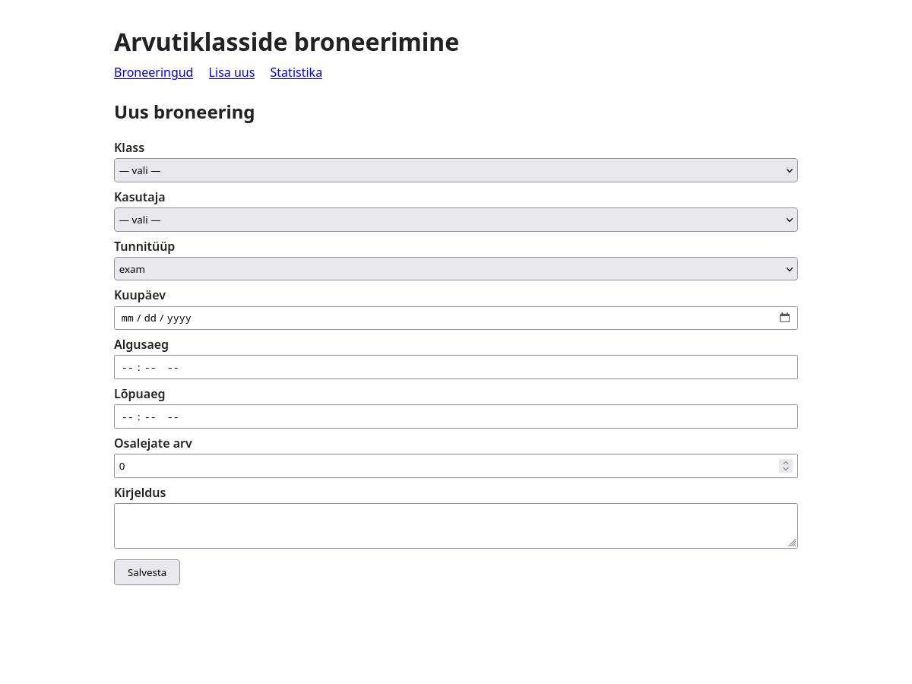
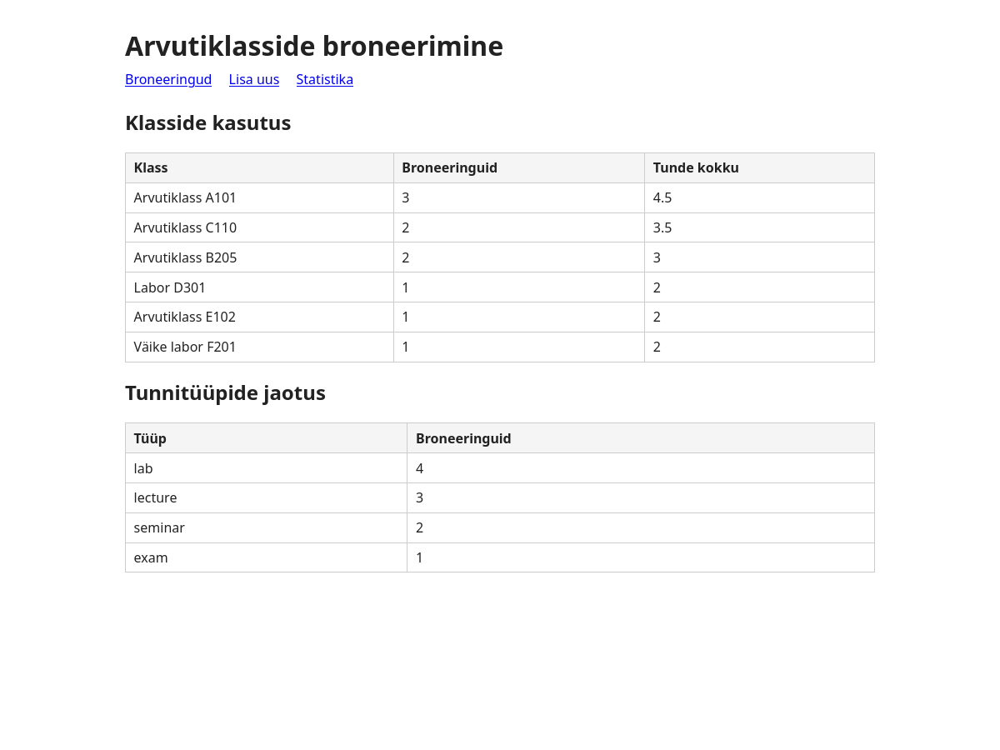

# Arvutiklasside broneerimise rakendus

Projekt TAK25: arvutiklasside broneerimise andmebaasirakendus (SQLite + Bun + Hono).

## Eeldused

- [Bun](https://bun.sh) (v1.0+)

## Käivitamine

```bash
cd app && bun install
cd ../import && bun run import.ts
cd ../app && bun run index.ts
```

Server käivitub aadressil: **http://localhost:3000**

## Funktsionaalsus

- **/** — broneeringute nimekiri (READ)
- **/bookings/new** — uue broneeringu lisamine (CREATE)
- **/bookings/:id/edit** — broneeringu muutmine (UPDATE)
- **/bookings/:id/delete** — broneeringu kustutamine (DELETE)
- **/stats** — statistikavaade (klasside kasutus tundides, tunnitüüpide jaotus)

## Ekraanipildid

### Broneeringute nimekiri


### Uue broneeringu lisamine


### Statistikavaade


## Projekti struktuur

```
├── schema.sql                  # DDL (tabelite loomine)
├── erd_crowsfoot.dbml          # ERD (dbdiagram.io)
├── uml_class.mmd               # UML klassidiagramm (mermaid.live)
├── logical_design.md           # Loogiline disain
├── permissions.sql             # MariaDB GRANT/REVOKE demo
├── permissions.md              # Õiguste selgitus
├── app/
│   ├── index.ts                # Hono server + CRUD
│   └── db.ts                   # SQLite ühendus
├── import/
│   ├── classes.csv             # Klassid (CSV)
│   ├── teachers.json           # Õpetajad/grupid (JSON)
│   ├── bookings.xml            # Broneeringud (XML)
│   └── import.ts               # Impordiskript
├── export/
│   ├── export.ts               # Ekspordiskript
│   ├── bookings_summary.csv    # Koondtabel kuu kaupa
│   └── top5_classes.json       # Top 5 klassid
└── backup/
    ├── backup_2026-02-11.sql   # Varukoopia
    └── backup_restore.md       # Varunduse juhend + tõendus
```

## Andmebaas

SQLite andmebaas luuakse automaatselt faili `database.db` projekti juurkausta.
Skeem on defineeritud failis `schema.sql`.
